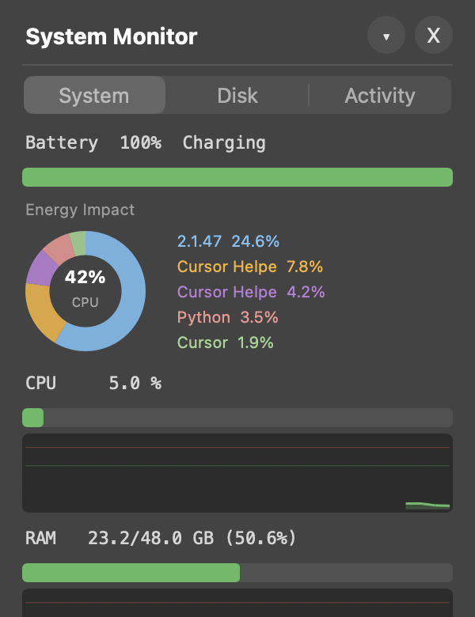

# SysMon — macOS 시스템 모니터 위젯

macOS에서 시스템 리소스를 실시간으로 모니터링하는 가벼운 데스크톱 위젯입니다.

Python + PyObjC (네이티브 Cocoa) 기반으로 제작되었습니다.


## 스크린샷

| System | Disk | Activity |
|:---:|:---:|:---:|
|  |  |  |

## 주요 기능

### System 탭
- **배터리** — 충전 잔량, 충전 상태, 남은 시간 + 에너지 영향도 도넛 차트 (상위 5개 프로세스)
- **CPU / RAM / GPU** — 실시간 사용률 + 컬러존 스파크라인 그래프 (초록 → 노랑 → 빨강)
- **네트워크** — 다운로드/업로드 속도 + 자동 스케일링 그래프

### Disk 탭
- 디스크별 사용량 도넛 차트 (여유/사용 공간)
- 가용 용량, 사용률 표시

### Activity 탭
- 실행 중인 모든 앱을 CPU 사용량(에너지 영향도) 순으로 정렬
- **Quit** 버튼으로 앱 즉시 종료 가능

### UI
- 다크 테마, 둥근 모서리의 플로팅 윈도우
- 접기/펴기 토글
- 메뉴바 컨트롤 (SysMon 상태 아이템)
- 스크롤 가능한 콘텐츠 영역
- 탭 인터페이스 (System / Disk / Activity)

## 빠른 설치

```bash
git clone https://github.com/doyeon95k/System-Monitor-for-MAC.git
cd System-Monitor-for-MAC
./install.sh
```

의존성 설치 후 `~/Applications`에 `SysMon.app`을 생성하고, Spotlight에서 검색할 수 있도록 등록합니다.

## 수동 설치

```bash
pip3 install --user -r requirements.txt
python3 ram_widget.py
```

## 독립 실행형 .app 빌드 (Python 없이 배포)

```bash
pip3 install py2app
python3 setup.py py2app
```

`dist/SysMon.app`이 생성됩니다. Python이 설치되지 않은 Mac에서도 더블클릭으로 실행 가능합니다.

## 로그인 시 자동 실행

```bash
osascript -e 'tell application "System Events" to make login item at end with properties {path:"'$HOME'/Applications/SysMon.app", hidden:true}'
```

## 메뉴바 사용법

메뉴바에서 **SysMon**을 클릭하면:
- 위젯 표시 / 숨기기
- 접기 / 펴기
- 종료

## 시스템 요구사항

- macOS 12 이상
- Python 3.9 이상 (Xcode Command Line Tools에 기본 포함)
- 의존성: `psutil`, `pyobjc-framework-Cocoa`

## 라이선스

MIT
